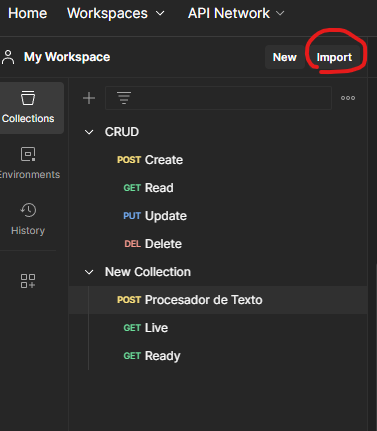
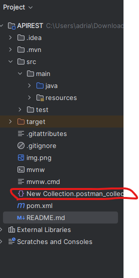

# **Microservicio de Procesamiento de Texto**

Este proyecto es un microservicio desarrollado en **Spring Boot** que procesa texto enviado a través de una API REST. El microservicio analiza las líneas del texto, valida su formato, y genera una respuesta procesada según las especificaciones.

## **Requisitos Previos**

### **Herramientas necesarias**
1. **Java**: JDK 17 o superior.
2. **Maven**: 3.8 o superior.
3. **IDE**: IntelliJ IDEA, Eclipse, o cualquier otro editor compatible con Java.
4. **Postman**: (Opcional) para pruebas de la API REST.
---
 
## importaciones de POSTMAN
Para importar la collection con los endpoints se realizan los siguientes pasos
1. Descargar el agente de postman: https://www.postman.com/downloads/postman-agent/
2. ejecutar postman
3. crear o iniciar sesion en postman
4. En la parte superior a la derecha de my workspace encontraran el boton para importar la collection 

---
5. seleccionar el archivo que esta adjunto al proyecto

   


6. listo ya deberias de tener los endpoints de este proyecto.
---
## **Características del Microservicio**

- **Procesamiento de Texto**:
    - Elimina caracteres no alfabéticos de las frases.
    - Determina si el número inicial corresponde a la cantidad de palabras en la frase.
- **Validación de Entrada**:
    - Responde con error si alguna línea no cumple con el formato requerido.
- **API REST**:
    - Fácil de consumir.
    - Documentada automáticamente con Swagger/OpenAPI.
- **Pruebas Unitarias**:
    - Validan los casos de éxito y los errores esperados.
- **Salud del Servicio**:
    - Incluye endpoints para verificar el estado.

---

## **Cómo Ejecutar el Proyecto**

### **1. Compilar el Proyecto**
Asegúrate de tener Java y Maven configurados. Luego ejecuta:
```bash
  mvn clean install
```
### **2. Ejecutar el Proyecto**
Asegúrate de tener Java y Maven configurados. Luego ejecuta:
```bash
  mvn spring-boot:run

```
### **3. Acceder a la API**

La API estará disponible en:
http://localhost:8080/api/v1/texto/procesar


## **Uso del Microservicio**

###  Endpoint Principal 

- URL: /api/v1/texto/procesar
    - Método: POST
    - Cuerpo de la solicitud (raw): Texto plano con formato: número\frase
 #### Ejemplo de Entrada: 
```
3\the force is strong in this one
7\take what you can give nothing back
```

#### Ejemplo de Salida:
```
[
    "the force is strong in this one\\false",
    "take what you can give nothing back\\true"
]

```
###  Errores
Si alguna línea no contiene \:
```
{
"timestamp": "2024-11-29T12:34:56.789+00:00",
"status": 400,
"error": "Bad Request",
"message": "Formato de entrada inválido. Falta el carácter '\\'.",
"path": "/api/v1/texto/procesar"
}
```
## **Documentación Swagger**
Swagger proporciona una interfaz interactiva para consumir y probar la API.

- UI: http://localhost:8080/swagger-ui/index.html
- Especificación JSON: http://localhost:8080/v3/api-docs

## **Pruebas Unitarias**
Las pruebas están incluidas en el proyecto, ubicadas en el paquete src/test/java/com.prueba.APIREST/.
 ### Ejecutar las pruebas
```
mvn test
```
## Endpoints de Salud
### Liveness Check:
- URL: /health/live
- Método: GET
- Respuesta: Live

### Readiness Check:
- URL: /health/ready
- Método: GET
- Respuesta: Ready

## Estructura del Proyecto
```
src/main/java/com/prueba/APIREST
├── controller/    # Controladores REST
├── model/         # Modelos de datos
├── service/       # Lógica de negocio
├── validator/     # Validación de datos
└── Application.java  # Clase principal
```
## Autor
- Desarrollado por: Adrian Humberto Duque Torrado
- Correo: adriantorrado1409@gmail.com


